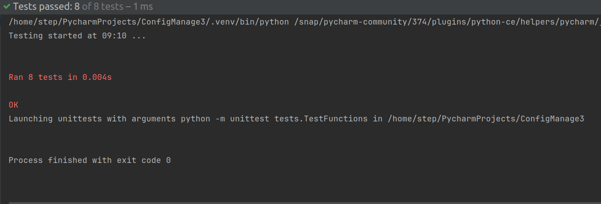

# Анализатор синтаксиса
## Задание
Разработать инструмент командной строки для учебного конфигурационного
языка, синтаксис которого приведен далее. Этот инструмент преобразует текст из
входного формата в выходной. Синтаксические ошибки выявляются с выдачей
сообщений.

Входной текст на учебном конфигурационном языке принимается из
стандартного ввода. Выходной текст на языке yaml попадает в файл, путь к
которому задан ключом командной строки.

Многострочные комментарии:  
|#  
Это многострочный  
комментарий  
#|  

Словари:  
table(  
имя => значение,  
имя => значение,  
имя => значение,  
...  
)

Имена:  
[_A-Z][_a-zA-Z0-9]*  
Значения:  
• Числа.  
• Строки.  
• Словари.

Строки:  
"Это строка"

Объявление константы на этапе трансляции:  
def имя := значение;

Вычисление константного выражения на этапе трансляции (префиксная форма), пример:  
![+ имя 1]

Результатом вычисления константного выражения является значение.
Для константных вычислений определены операции и функции:
1. Сложение.
2. Вычитание.
3. Умножение.
4. Деление.
5. chr().

Все конструкции учебного конфигурационного языка (с учетом их
возможной вложенности) должны быть покрыты тестами. Необходимо показать 3
примера описания конфигураций из разных предметных областей.

## Реализация
Программа была реализована на языке python с использованием встроенных модулей 
sys для управления выходом из программы, 
re для работы с регулярными выражениями 
и argparse для парсинга аргументов командной строки.

Для проверки работы программы были созданы 3 файла, 
описывающие конфигурацию приложения, игры и сервера на учебном конфигурационном языке.

## Тесты
Тесты реализованы с помощью модуля unittest. 
Проект содержит модуль tests, в котором находятся тесты различных функций программы. 
Программа запускает функцию с исходным набором данных, а затем сравнивает полученные данные с ожидаемыми.
### Результаты тестов

